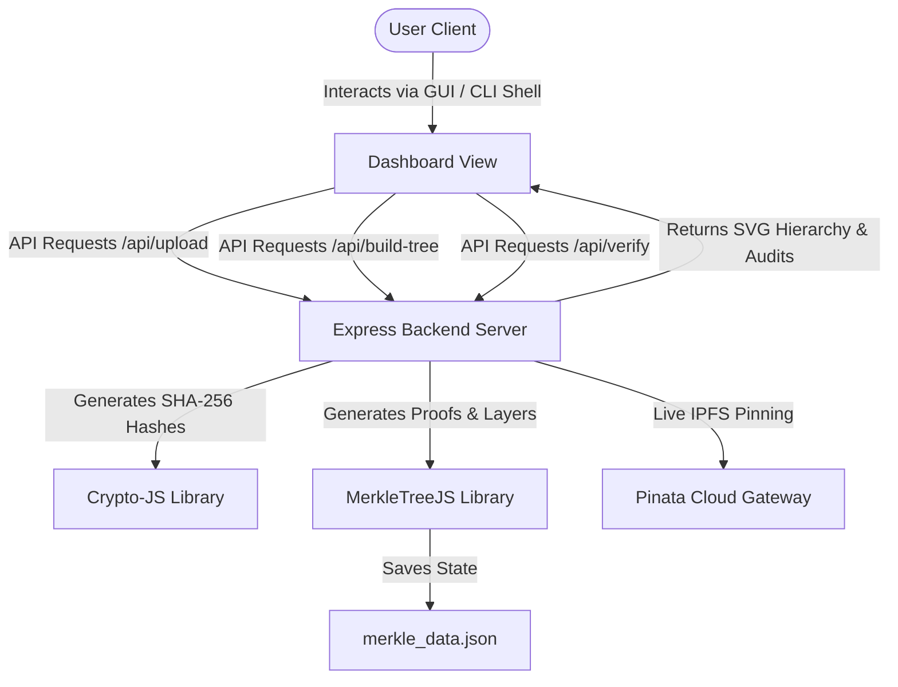

# 🌳 CryptoShield Merkle Engine

> A high-fidelity, interactive cryptographic audit dashboard and terminal sync emulator demonstrating how Merkle Trees verify data integrity in distributed networks (IPFS/Blockchain).

[](https://vercel.com)
[](https://github.com/brix/crypto-js)
[](https://github.com/miguelmota/merkletreejs)

---

## 📖 Overview

**CryptoShield Merkle Engine** converts abstract cryptographic hashing and dataset proofs into a visual, hands-on learning experience. The project bridges a **sleek graphical workspace** with an **interactive terminal command shell**, keeping both interfaces 100% synchronized in real-time. 

Users can upload files, retrieve IPFS Content Identifiers (CIDs), generate Merkle Roots, and perform audit trails. When verifying a CID, the SVG graph automatically traces and illuminates the exact mathematical validation path (leaf-to-root) using glowing neon colors.

---

## 🌟 Key Features

*   **Interactive Cryptographic Graph**: Dynamic bottom-up layout engine generating custom node networks in SVG. Includes drag-and-drop pan/zoom controls and detail cards showing full hex hashes and child sources.
*   **Bi-Directional Terminal Sync Emulator**: A developer console mirroring the CLI behavior of `simulation.js`. Typing commands (e.g. `role server`, `build`) controls the GUI, and clicking buttons in the UI echoes outputs to the shell.
*   **Dual Upload Modes**: Toggle between **Local Simulation** (fast, offline mock CID creation) and **Live IPFS Uploads** (pins files directly to the IPFS gateway via Pinata Cloud).
*   **Visual Integrity Auditing**: Audit specific CIDs and visually trace the verification sibling proof. Valid paths glow emerald green (`#10b981`), while sibling hashes light up in gold (`#f59e0b`).
*   **State Persistence**: Saves tree structures to `merkle_data.json` to keep data synchronized with backend CLI workflows.
*   **Cloud Serverless Ready**: Fully configured with `vercel.json` routing rules and cross-platform `os.tmpdir()` writable paths, making it deployable to Vercel in seconds.

---

## ⚙️ Architecture Flow



---

## 🛠️ Technology Stack

*   **Core**: HTML5 Semantic Markup & Vanilla CSS3 Custom Themes (Cyberpunk/Dark Mode)
*   **Frontend Logic**: Vanilla ES6 JavaScript (No bulky client frameworks, loads instantly)
*   **Backend Server**: Node.js, Express, Multer (multipart upload handling), Axios
*   **Cryptography**: `merkletreejs` (Merkle tree compilation/proof generation), `crypto-js` (SHA-256 hashing)

---

## 🚀 Getting Started

### 1. Prerequisites
Ensure you have [Node.js](https://nodejs.org/) installed (v16+ recommended).

### 2. Installation
Clone the repository and install the project dependencies:
```bash
git clone https://github.com/yourusername/merkle-proof-engine.git
cd merkle-proof-engine
npm install
```

### 3. Running Locally
Start the server:
```bash
npm start
```
The server will boot and run on **[http://localhost:3000](http://localhost:3000)**. Open your browser and navigate here to interact with the dashboard.

---

## ⌨️ Interactive Shell Command Reference

You can control the entire application directly by typing in the console at the bottom of the screen:

| Command | Action |
| :--- | :--- |
| `help` | Prints CLI usage guidelines and command syntax. |
| `role server` | Switches active workspace tab to the Server publishing panel. |
| `role client` | Switches active workspace tab to the Client verification panel. |
| `clear` | Clears terminal log lines. |
| `[file1.jpg, file2.jpg]` | (In Server Mode) Uploads specified files, generates the Merkle Tree, and visualizes the structure. |
| `[IPFS CID]` | (In Client Mode) Performs an integrity audit for that CID and traces the path in the graph. |

---

## ☁️ Deployment (Vercel)

This repository includes a preconfigured `vercel.json` deployment script. You can deploy it to Vercel instantly.

### Deploying via Vercel CLI:
1. Install the Vercel CLI tool:
   ```bash
   npm install -g vercel
   ```
2. Deploy the project:
   ```bash
   vercel
   ```
3. Deploy to production:
   ```bash
   vercel --prod
   ```

---

## 📝 License
This project is licensed under the ISC License. Feel free to use and distribute it for educational purposes.
